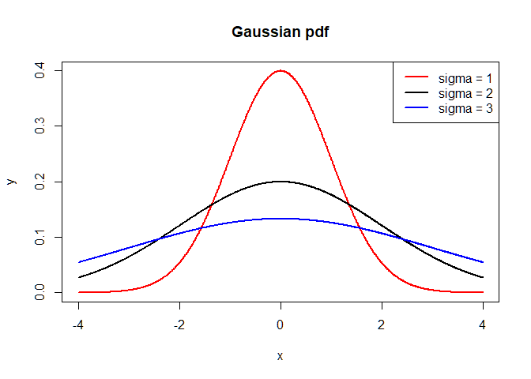
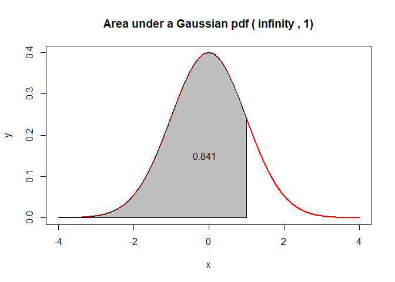
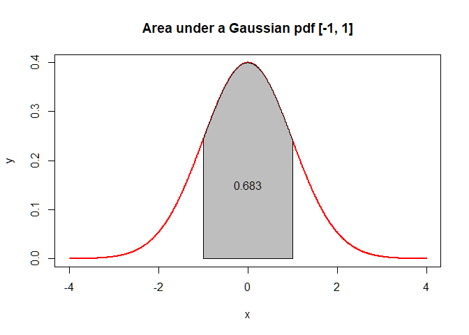
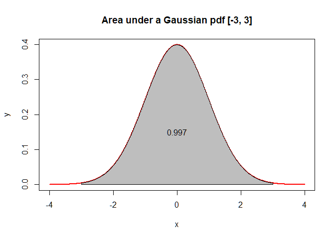

Gaussian Distribution pdf cdf
================

This is an example of how to plot the Gaussian distribution in R. Recall the notation for a Gaussian (a.k.a. Normal) random variable is *X* ∼ *N*(*μ*, *σ*<sup>2</sup>), which has parameters *μ* ∈ ℝ, the *mean*, and *σ*<sup>2</sup> &gt; 0, the *variance*. The probability density function (pdf) for a normal random variable is given by

$$
f(x) = \\frac{1}{\\sqrt{2 \\pi} \\sigma} \\exp\\left(-\\frac{(x - \\mu)^2}{2 \\sigma^2}\\right).
$$

First, for plotting functions of *x*, create a sequence of *x* values in the range -4 to 4 in increments of 0.01.

``` r
x = seq(-4, 4, 0.01)
```

Next, the *y* values correspond to the Gaussian pdf, with *μ* = 0 and *σ* = 1. This uses the built-in `dnorm` command in R.

``` r
y = dnorm(x, mean = 0, sd = 1)
```

An equivalent line of code would be to type in the formula yourself:

``` r
y = (1 / sqrt(2 * pi)) * exp(-0.5 * x^2)
```

Now plot the Gaussian pdf as a continuous curve:

``` r
plot(x, y, type = 'l', lwd = 2, col = 'red', main = "Gaussian pdf")
```


Note the effect of changing the mean (*μ*). We can plot these on top of the previous plot by using the `lines` command.

``` r
y2 = dnorm(x, mean = -1, sd = 1)
y3 = dnorm(x, mean = 2, sd = 1)

plot(x, y, type = 'l', lwd = 2, col = 'red', main = "Gaussian pdf")
lines(x, y2, col = 'black', lwd = 2)
lines(x, y3, col = 'blue', lwd = 2)
legend("topright", lwd = 2, c("mu = 0", "mu = -1", "mu = 2"),
       col = c("red", "black", "blue"))
```


Now let's check the effect of changing the standard deviation ().

``` r
y2 = dnorm(x, mean = 0, sd = 2)
y3 = dnorm(x, mean = 0, sd = 3)

plot(x, y, type = 'l', lwd = 2, col = 'red', main = "Gaussian pdf")
lines(x, y2, col = 'black', lwd = 2)
lines(x, y3, col = 'blue', lwd = 2)
legend("topright", lwd = 2, c("sigma = 1", "sigma = 2", "sigma = 3"),
       col = c("red", "black", "blue"))
```



The `pnorm` function will give you the cdf. So, `pnorm(a)` returns *P*(*X* ≤ *a*). You can also specify the mean and standard deviation, just like `dnorm`.

Examples:

``` r
pnorm(0, mean = 0, sd = 1)
```

    ## [1] 0.5

``` r
pnorm(1, mean = 0, sd = 1)
```

    ## [1] 0.8413447

Here is a plot of the cdf:

``` r
plot(x, pnorm(x, mean = 0, sd = 1), type = 'l', lwd = 2, main = "Gaussian cdf")
```


To get the probability in a range \[*a*, *b*\], that is, *P*(*a* ≤ *X* ≤ *b*), you would use the `pnorm(b) - pnorm(a)`

Example: probability (area) between \[ − 1, 1\]:

``` r
pnorm(1, mean = 0, sd = 1) - pnorm(-1, mean = 0, sd = 1)
```

    ## [1] 0.6826895

Example: area between \[0, 2\]:

``` r
pnorm(2, mean = 0, sd = 1) - pnorm(-2, mean = 0, sd = 1)
```

    ## [1] 0.9544997

Here are some fancy plots for showing the shaded-in area under the pdf curve.

``` r
# First the area between (-infinity, 1]
x = seq(-4, 4, 0.01)
y = dnorm(x)
plot(x, y, type = 'l', lwd = 2, col = 'red',
     main = paste("Area under a Gaussian pdf (", expression(infinity), ", 1)"))

x = seq(-4, 1, 0.01)
y = dnorm(x)
polygon(c(-4, x, 1), c(0, y, 0), col = "grey")
text(-0.1, 0.15, format(pnorm(1), digits = 3))
```



``` r
# These next plots are the 1, 2, and 3 standard deviation rules

# Sigma = 1
x = seq(-4, 4, 0.01)
y = dnorm(x)
plot(x, y, type = 'l', lwd = 2, col = 'red',
     main = "Area under a Gaussian pdf [-1, 1]")

x = seq(-1, 1, 0.01)
y = dnorm(x)
polygon(c(-1, x, 1), c(0, y, 0), col = "grey")
text(0, 0.15, format(pnorm(1) - pnorm(-1), digits = 3))
```



``` r
# Sigma = 2
x = seq(-4, 4, 0.01)
y = dnorm(x)
plot(x, y, type = 'l', lwd = 2, col = 'red',
     main = "Area under a Gaussian pdf [-2, 2]")

x = seq(-2, 2, 0.01)
y = dnorm(x)
polygon(c(-2, x, 2), c(0, y, 0), col = "grey")
text(0, 0.15, format(pnorm(2) - pnorm(-2), digits = 3))
```


``` r
# Sigma = 3
x = seq(-4, 4, 0.01)
y = dnorm(x)
plot(x, y, type = 'l', lwd = 2, col = 'red',
     main = "Area under a Gaussian pdf [-3, 3]")

x = seq(-3, 3, 0.01)
y = dnorm(x)
polygon(c(-3, x, 3), c(0, y, 0), col = "grey")
text(0, 0.15, format(pnorm(3) - pnorm(-3), digits = 3))
```


